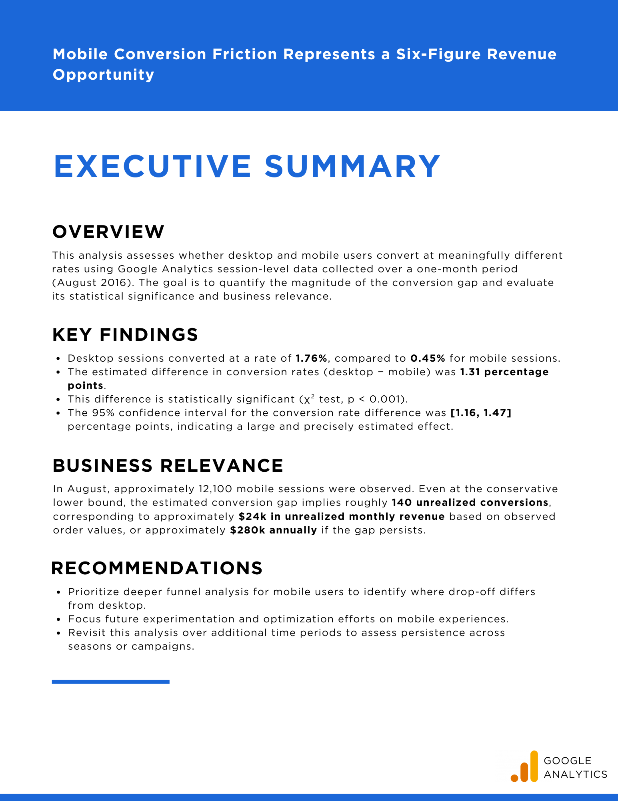

# Mobile Conversion Friction Represents a Six-Figure Revenue Opportunity

## Executive Summary
Desktop users converted at a significantly higher rate than mobile users during August 2016.
The estimated conversion gap was **1.16–1.47 percentage points**, corresponding to approximately
**140 unrealized mobile conversions** and **~$24k in unrealized monthly revenue** under conservative assumptions.

**Download the executive summary (PDF):**  
[02_Mobile_Conversion_Friction_Represents_a_Six-Figure_Revenue_Opportunity.pdf](02_Mobile_Conversion_Friction_Represents_a_Six-Figure_Revenue_Opportunity.pdf)

## Project Structure
- `data/` - Data extracted from BigQuery SQL from bigquery-public-data.google_analytics_sample.
- `sql/` - BigQuery SQL used for data extraction
- `figures/` - Saved visualizations  
- `01_device_conversion_statistical_analysis.ipynb` - Technical statistical analysis  
- `02_Mobile_Conversion_Friction_Represents_a_Six-Figure_Revenue_Opportunity.pdf` - Executive-facing summary  

## Key Takeaway
Mobile conversion underperformance represents a high-leverage optimization opportunity with
material revenue implications if the observed gap persists.

## Tools & Technologies
- **SQL (BigQuery)** - session-level data extraction from Google Analytics public dataset  
- **Python** - statistical analysis and estimation  
- **pandas / NumPy** - data manipulation  
- **SciPy** - chi-square testing and confidence interval estimation  
- **Matplotlib** - data visualization  
- **Jupyter Notebook** - reproducible analysis
